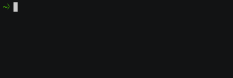

# geojson-xyz

_Get GeoJSON by choosing categories & subcategories on the command line.
Choose a file and it's instantly downloaded._

_Or supply a bit of a filename, like `ocean` or `rail`, and a fuzzy
search magically guesses which file you want, and downloads it for you._

## install

    npm install -g geojson-xyz

## usage

After installing, just run `geojson-xyz`.

## cred

All praise to [Natural Earth Data](http://www.naturalearthdata.com/) as
the source of the majority of the data exposed in this interface. This is
mostly a different way to access that data.

## goes well with

Running

    geojson-xyz airports -

Means "fuzzy-match airports and output results to stdout". You can substitute
anything else for 'airports'. Outputting to stdout means you can pipe that
GeoJSON places - for instance, if you have [geojsonio-cli](https://github.com/mapbox/geojsonio-cli)
installed, pipe it to `geojsonio`!

